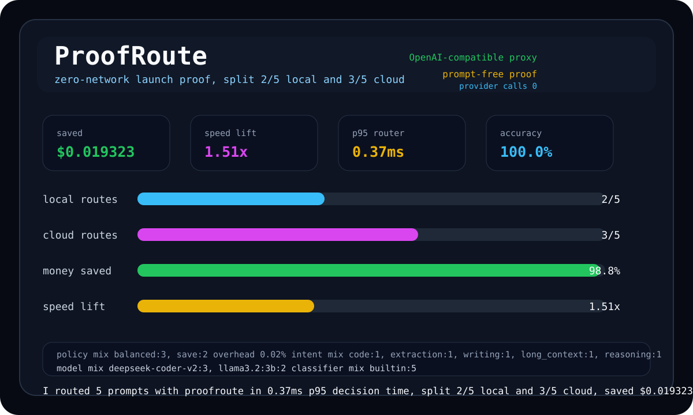
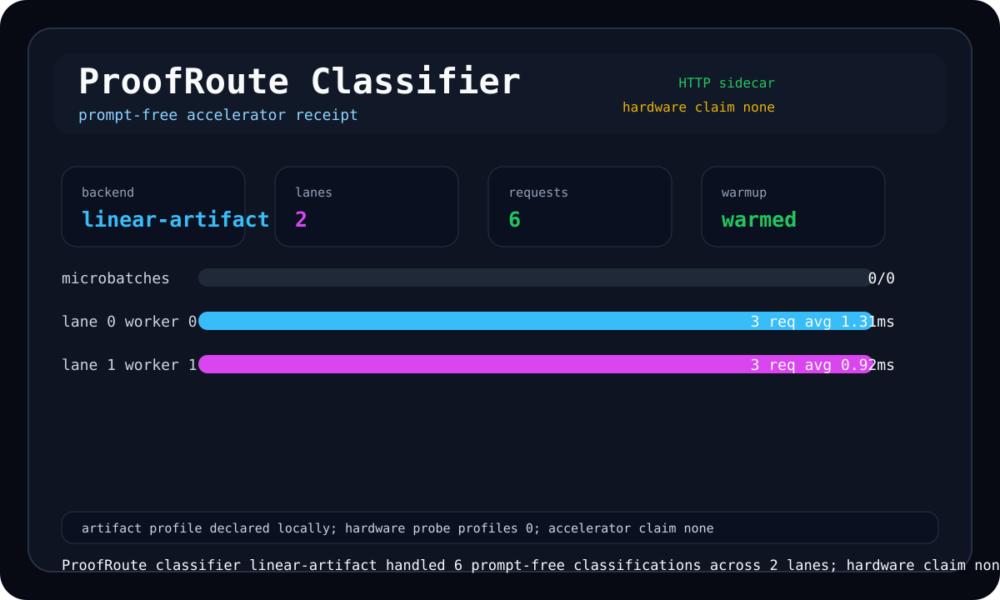

# ProofRoute

[English](README.md) | [简体中文](README.zh-CN.md)

[](https://github.com/Lling0000/proofroute/actions/workflows/ci.yml) [](https://github.com/Lling0000/proofroute) [](LICENSE) [](package.json) [](package.json) [](#proofroute) [](docs/architecture.md)

ProofRoute 是为 Vibe Coding 准备的隐形大模型路由器。它以 CLI-first 的方式作为 OpenAI 兼容透明代理运行，在开发工具真正调用模型之前，本地识别 prompt 意图，估算上下文和输出预算，然后把请求路由给成本更低、速度足够快、质量匹配当前任务的本地或云端模型，并在终端给出速度提升、资金节省和隐私边界的可复核证据。

它解决的是开发者每天都会遇到的模型选择焦虑。你不需要在写代码时暂停下来比较模型，不需要打开另一个 dashboard，也不需要把 prompt 文本交给托管遥测服务。ProofRoute 把模型选择变成一次几乎不可见的本地决策，把价值证明变成一张可以截图、贴进 PR、放进 CI、写进发布说明的终端收据。



ProofRoute 的架构遵循 Agent-View-Controller。Controller 负责本地意图识别、token 估算、上下文匹配、成本建模、延迟建模和数值稳定的 Softmax 排名。Agent 负责异步 provider 执行、OpenAI 兼容转发、Ollama 适配、fallback 执行和基准编排。View 负责终端原生 proof card、route trace、Markdown receipt、连接卡片、模型目录、统计视图、调优输出和 classifier receipt。这个边界让路由决策既快又可解释，也让未来的 GPU classifier 能替换 Controller 内部实现，而不破坏代理、证据和终端体验。

默认体验刻意保持零配置。开发者可以克隆仓库，直接运行本地 demo，在没有 API key、没有网络调用、没有 provider 配置的情况下看到路由证明。真正启动代理后，现有 SDK、编辑器扩展、CLI 工具和 Agent 只需要把 OpenAI Base URL 指向 ProofRoute，就能继续调用熟悉的 chat completions 接口，而路由器会在后台根据意图、上下文、价格和延迟选择更合适的模型。

## 快速开始

最快的第一步是运行 demo。这个命令不会访问外部网络，也不需要 provider 凭证，它会直接展示路由决策、p95 Controller 延迟、预估节省、速度提升和路由分布。

```sh
node ./bin/proofroute.js demo
```

安装或链接包之后，开发者应该记住的命令是 `proofroute demo`。在克隆仓库里，如果本机有 npm，`npm run demo` 指向同一个零网络 proof；在 npm 公网可见性被发布门禁证明之前，最诚实的复制运行路径仍然是从这个仓库直接执行 Node 命令。

```sh
proofroute demo
```

## 证据包

维护者最重要的第一条命令是 core release proof pack。它不需要 API key，不调用外部 provider，也不会宣称 CUDA、TensorRT 或多 GPU 加速；它只证明仓库门面、零网络路由价值、代理 smoke 路径、prompt-free 隐私边界、SVG 收据、git provenance 和 launch copy 都可以在普通笔记本上复现。

```sh
node ./bin/proofroute.js release --core --out proofroute-release-pack
```

当维护者想要更强的普通笔记本证据时，`npm run classifier:artifact:evidence` 和 `npm run classifier:artifact:verify` 可以生成并验证 `classifier-linear-evidence.json`，然后把本地 artifact proof 合入同一个无硬件宣称的 release archive。这个路径证明的是本地 classifier 模型 artifact 的哈希和 benchmark gate，而不是 CUDA、TensorRT 或多 GPU 硬件。

```sh
node ./bin/proofroute.js release --core --require-artifact-evidence --artifact-evidence classifier-linear-evidence.json --max-evidence-age-hours 24 --out proofroute-release-pack
```

任何硬件加速宣称在进入公开文案之前，都必须先通过严格证据。`node ./bin/proofroute.js doctor --strict-hardware` 会检查 classifier 是否是已 warm 的 HTTP sidecar，是否至少有两个 device、两个 lane，并且 device profiles 是否来自 nvidia-smi。`node ./bin/proofroute.js release --preflight --require-evidence --evidence classifier-evidence.json --max-evidence-age-hours 24` 会解释严格 release blocker，而不会写入 proof pack，也不会默认运行 proxy smoke。这个边界让普通机器可以发布 artifact proof，同时要求 NVIDIA 机器用真实硬件证明自己的 CUDA、TensorRT 和多 GPU 叙事。

## 日常工作流

ProofRoute 的第一轮传播路径围绕终端 proof 展开。`node ./bin/proofroute.js share` 或 `npm run share` 适合生成 launch 截图，`node ./bin/proofroute.js share --markdown` 或 `npm run share:markdown` 适合粘贴到 README、PR 评论、讨论区和发布帖，`node ./bin/proofroute.js share --svg --out docs/proofroute-terminal.svg` 或 `npm run share:svg` 适合更新仓库 hero 资产。公开门面通过 `node ./bin/proofroute.js profile`、`node ./bin/proofroute.js profile --check-public`、`node ./bin/proofroute.js launch`、`node ./bin/proofroute.js launch --check-public` 和 `node ./bin/proofroute.js prove --max-p95-ms 5 --min-accuracy 0.8` 与真实可执行证据绑定，避免 README 热情和实际发布状态漂移。

代理运行后，`node ./bin/proofroute.js stats --since 1h`、`node ./bin/proofroute.js stats --watch --since 1h`、`node ./bin/proofroute.js privacy --file .proofroute/events.jsonl`、`node ./bin/proofroute.js share --ledger --since 1h --markdown`、`node ./bin/proofroute.js prove --ledger --since 1h --min-requests 20 --max-p95-ms 5 --max-router-overhead-pct 1 --max-classifier-circuit-open 0` 和 `node ./bin/proofroute.js tune --since 1h --export tuned-router.json` 会把当前 coding session 变成一个私有 proof loop。团队可以基于真实代理流量证明节省、速度、策略和隐私边界，而不需要导出 prompt 或 completion 文本。

## OpenAI 兼容代理

day-one 集成刻意紧凑。`node ./bin/proofroute.js connect --port 8787` 会打印 OpenAI 兼容 Base URL 和验证命令，`eval "$(node ./bin/proofroute.js connect --shell sh)"` 会把同样的环境变量注入当前 shell。如果第一个可执行模型已经在 LM Studio、vLLM 或其他本地 OpenAI 兼容网关后面，`node ./bin/proofroute.js connect --local-openai http://127.0.0.1:1234/v1 --local-openai-model qwen3` 会同时输出客户端需要的 OpenAI 变量和代理侧的 `PROOFROUTE_LOCAL_OPENAI_*` 变量，让第一条路由请求不依赖 `router.json`。

```sh
node ./bin/proofroute.js connect --port 8787
eval "$(node ./bin/proofroute.js connect --shell sh)"
```

启动透明代理后，现有 OpenAI 兼容客户端可以把 base URL 指向 `http://127.0.0.1:8787/v1`。ProofRoute 支持 `/v1/chat/completions`、`/v1/completions`、`/v1/responses`、`/v1/models` 和 `/ready`，并通过浏览器可读 response headers 暴露最终模型、请求模型、模型替换状态、策略、意图、决策延迟、router overhead、缓存状态、classifier backend、fallback、预估节省、实际 token 和实际节省。

```sh
node ./bin/proofroute.js proxy --port 8787 --config examples/router.json
```

## 路由证明

单个 prompt 的可解释路径从 `route` 开始。普通路由会展示意图、策略、选中模型、备选模型、预估延迟、预估成本和相对最贵可行 baseline 的节省；trace 模式会进一步展示策略权重、质量、上下文、本地偏置、requested-model、成本、延迟等贡献，以及因为上下文、可执行性、预算或延迟上限被过滤掉的模型。

```sh
node ./bin/proofroute.js route --trace --prompt "Refactor this webhook, explain the bug, and write a regression test."
```

更广的本地证据来自 `bench`、`calibrate`、`plan` 和 `fanout`。`bench` 重复运行本地路由并输出 p50、p95、节省和速度提升，`calibrate` 基于 labeled prompt suite 输出意图准确率和模型分布，`plan` 为复杂请求生成多智能体路由计划，`fanout` 把可执行角色决策并行派发到配置的 providers。这些命令让开发者在不离开终端的情况下验证 ProofRoute 是否真的减少了模型选择成本。

## 命令表面

`demo` 是零网络第一印象。`share` 把同一份 proof 变成适合截图和 Markdown 的路由收据。`prove` 把延迟、节省、速度、请求量和准确率变成会失败的本地或 CI gate。`connect` 打印 drop-in proxy 连接卡片。`models` 渲染可执行模型目录、上下文窗口、价格、延迟和每类意图 leader。`smoke` 在无外部凭证的情况下用 fake provider 验证 runtime 或透明代理。`stats` 把本地 ledger 渲染成终端 proof。`privacy` 扫描 ledger 是否出现 prompt、completion、raw request、raw response 或 credential-shaped 字段。`doctor` 检查 runtime、providers、telemetry 路径、classifier、sidecar 和 policy。`tune` 从本地 telemetry 推荐可审查的 routing-policy patch。`publish` 在 release copy 允许告诉别人安装前检查 package、npm、公开 GitHub、公开 npm、authenticated GitHub 和 Actions 表面。`proxy` 启动真正的 OpenAI 兼容透明代理。

发布门禁输出的是证据而不是安慰。`node ./bin/proofroute.js publish --check-public --check-actions` 或 `npm run publish:preflight` 会产出机器可读的 `blockers` 和 `nextActions`，`--probe-actions-dispatch` 会主动触发 workflow dispatch 来证明账号层 Actions 限制，`--support-note` 会把同一份证据渲染成可复制给外部支持或 release log 的脱敏纯文本，而 `--json` 始终优先保留自动化需要的 JSON 输出。

## 配置与隐私

配置使用普通 JSON，因为路由策略应该可以审查和复制。Providers 定义 base URL、凭证和协议形态，models 定义上下文窗口、价格、中位延迟、吞吐、provider、endpoint、本地性和 per-intent 质量。默认目录包含本地 Ollama 风格执行和若干 cloud-shaped entries，因此克隆后马上能观察 scoring 行为；生产使用时，团队应该把示例价格和延迟替换为自己的真实观测值。

```sh
node ./bin/proofroute.js init > router.json
```

从 LM Studio、vLLM 或其他本地 OpenAI 兼容服务开始时，`node ./bin/proofroute.js init --preset local-openai > router.json` 会生成与 `examples/local-openai-router.json` 一致的可执行本地网关形态，包括 `requiresApiKey: false`、本地策略偏置和 command-backed classifier 示例。环境变量 `PROOFROUTE_LOCAL_OPENAI_BASE_URL` 可以在不写 JSON 的情况下追加一个零价格本地 OpenAI 兼容模型，`PROOFROUTE_LOCAL_OPENAI_MODEL`、`PROOFROUTE_LOCAL_OPENAI_CONTEXT_WINDOW`、`PROOFROUTE_LOCAL_OPENAI_LATENCY_MS` 和 `PROOFROUTE_LOCAL_OPENAI_TOKENS_PER_SECOND` 可以让生成模型贴近真实网关。

ProofRoute 默认把隐私边界放在本地。路由缓存使用 prompt fingerprint，不把 prompt 文本落盘；代理默认写入 `.proofroute/events.jsonl`，其中保存的是时间戳、请求模型、最终模型、模型替换状态、provider、本地性、策略、意图、classifier backend、confidence、token 估算、成本估算、节省、速度提升、决策延迟、router overhead、端到端延迟、streaming 模式和状态码。非 streaming 上游返回 usage metadata 时，ledger 还可以记录实际 input tokens、output tokens、total tokens、实际路由成本、baseline 成本和实际节省，但不会保存 prompt 或 completion 文本。

## Classifier 加速

当前本地 classifier 是紧凑、确定性、零依赖的实现。它使用加权 lexical features、prompt shape signals、token pressure 和稳定概率分布，在 code、reasoning、writing、extraction、long_context 和 chat 意图之间做选择。这个实现的接口故意为未来原生 GPU classifier 留出空间，因此 ONNX、TensorRT、vLLM 或私有 embedding 后端可以替换 scoring 内部，而不改变 Agent、View、proxy、benchmark 或 evidence contract。



持续运行的本地加速器可以通过 `PROOFROUTE_CLASSIFIER_URL` 或 JSON 配置里的 `classifier.url` 接入 Controller。仓库提供 `proofroute-classifier` 参考 sidecar，暴露 `GET /health`、`GET /ready`、`GET /metrics`、`POST /warmup`、`POST /classify` 和 `POST /classify/batch`，并报告 backend、scheduler、warmup、batch、lane、device profile、request count、error count、uptime、inflight、per-lane 统计和 decision time。device profile 可以来自环境变量，也可以在配置允许时来自有界 `nvidia-smi` 启动探测；公开 CUDA、TensorRT 或多 GPU 文案必须来自 `npm run classifier:hardware:evidence` 和 `npm run classifier:hardware:verify` 的严格路径。

```sh
PROOFROUTE_CLASSIFIER_URL=http://127.0.0.1:8788/classify node ./bin/proofroute.js route --prompt "Refactor this function and add a regression test."
```

## 开发与发布

测试聚焦在最影响可信度的地方。Softmax 测试防止溢出和无效概率质量，classifier 测试保护 code-heavy prompt 识别，route controller 测试验证完整决策包含 ranked candidates、cost savings 和 latency estimates，release 和 repository-profile 测试则把 README、GitHub About、topics、npm metadata、public visibility、SVG proof assets、privacy boundary 和 classifier evidence 纳入可执行门控。

```sh
node --test
```

维护者侧仓库文案在 [docs/repository-profile.md](docs/repository-profile.md)，同一公共表面可以通过 `node ./bin/proofroute.js profile` 或 `npm run profile` 打印。release 侧入口是 `node ./bin/proofroute.js launch` 或 `npm run launch`，它会把仓库门面、零网络 proof、proxy smoke、隐私审计、share asset 检查和 classifier evidence 状态合并成一张 readiness card。需要把真实公网状态纳入门控时，`node ./bin/proofroute.js launch --check-public` 和 `node ./bin/proofroute.js release --preflight --core --check-public` 会检查公开 GitHub 与 npm 可见性，而不会默认修改远端或写出 proof pack。最后一层发布门禁是 `node ./bin/proofroute.js publish --check-public --check-actions` 或 `npm run publish:preflight`，它会同时检查 package metadata、npm CLI、npm pack dry-run 内容、npm publish dry-run 是否会被自动修正、npm registry 登录态、公开 GitHub 与 npm 可见性，以及最近的 GitHub Actions 证据，并输出机器可读的 `blockers` 和 `nextActions`，让 npm 登录缺失、GitHub 账号可见性限制、匿名 404 和 Actions 禁用变成明确的发布清单。遇到账号层平台限制时，`npm run publish:support-note` 会生成可复制、脱敏、纯文本的支持说明，但不会绕过任何 blocker，也不会把外部账号限制伪装成代码发布成功。

ProofRoute 想成为开源基础设施里的一个高传播心跳。它最强的 demo 不是幻灯片，也不是落地页，而是一张终端截图：真实 prompt 在毫秒级被路由，本地模型在该赢的时候赢，高质量模型在值得时赢，精确节省金额和工程决策出现在同一个画面里。

## License

MIT. See [LICENSE](LICENSE).
